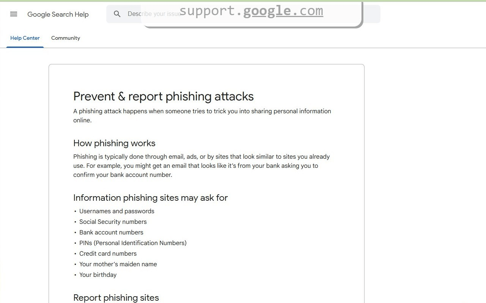

# UrlScope Chrome Extension
{:height="64px" width="64px"}

When navigating to a different web site, UrlScope flashes the hostname of the current URL on top of the page with the most relevant part underlined. Recognizing the relevant part of a URL can help to avoid phishing.

